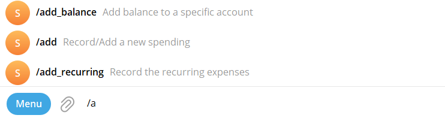
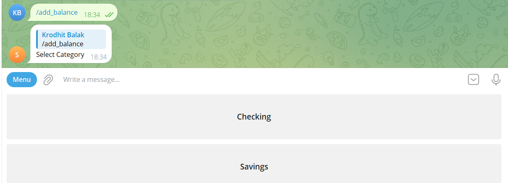
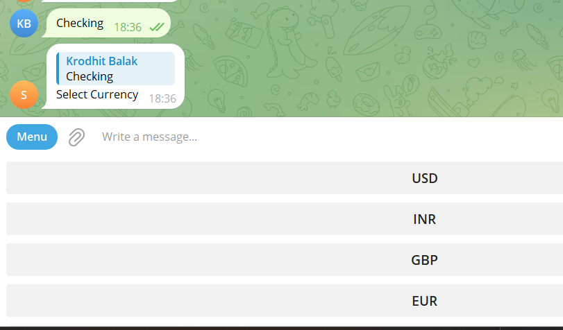
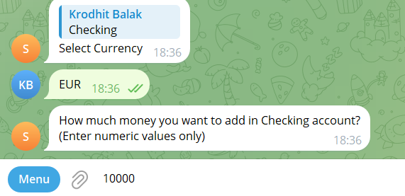
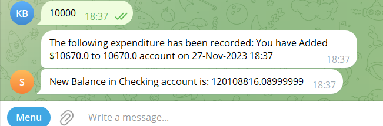

**Tutorial to add Balance:**

1.  Type '/add_balance' in the chat or select '/add_balance' option from
    the menu.

2.  Now, you will be prompted to select the balance category.

3.  After you have successfully selected a category, you will be
    prompted to add an input currency.

4.  Now, you will be prompted to add an amount. Please enter the amount
    in your selected currency.

5.  You are all done!! Your expense will be successfully recorded.

